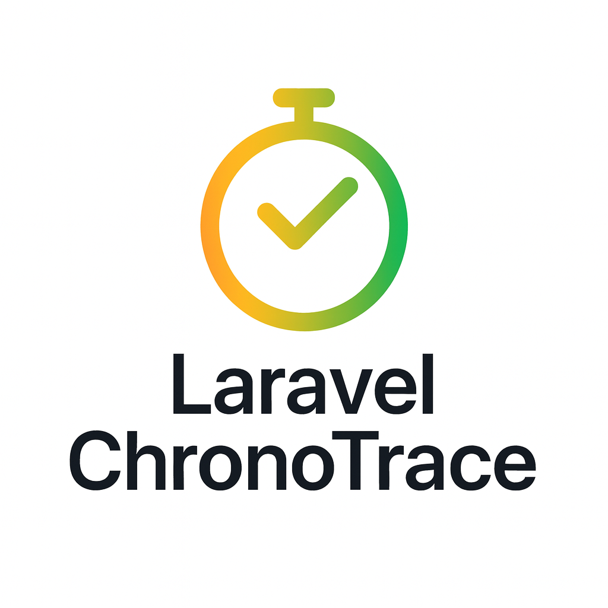

# Laravel ChronoTrace

<div align="center">
  
  <p><strong>⏱️ Record and replay Laravel requests deterministically — capture all database queries, cache operations, HTTP calls, and queue jobs for debugging and analysis.</strong></p>

  [](https://packagist.org/packages/grazulex/laravel-chronotrace)
  [](https://packagist.org/packages/grazulex/laravel-chronotrace)
  [](https://github.com/Grazulex/laravel-chronotrace/blob/main/LICENSE.md)
  [](https://php.net/)
  [](https://laravel.com/)
  [](https://github.com/Grazulex/laravel-chronotrace/actions)
  [](https://github.com/laravel/pint)
</div>

---

## 📖 Overview

**Laravel ChronoTrace** is a powerful debugging and monitoring tool for Laravel applications that allows you to:

- **🎯 Capture** HTTP requests and their complete execution context (DB queries, cache operations, external HTTP calls, queue jobs)
- **🔄 Replay** traces to analyze what happened during specific requests
- **🔍 Debug** production issues with comprehensive event logs
- **📊 Monitor** application performance and identify bottlenecks

Perfect for debugging hard-to-reproduce issues, performance analysis, and understanding complex application flows.

---

## ✨ Features

- **⏺️ Smart Recording** – Multiple recording modes: always, sample rate, error-only, or targeted routes
- **📊 Comprehensive Event Capture** – Database queries, cache operations, HTTP requests, queue jobs, and custom events
- **🔄 Detailed Replay** – View complete execution flow with timestamps and performance metrics
- **🎯 Flexible Filtering** – Focus on specific event types (DB, cache, HTTP, jobs) during analysis
- **💾 Multiple Storage Options** – Local storage, S3, or custom storage adapters
- **🔐 PII Scrubbing** – Automatically mask sensitive data (passwords, tokens, emails, etc.)
- **⚡ Async Storage** – Queue-based storage for minimal performance impact
- **🗂️ Automatic Cleanup** – Configurable retention policies and automatic purging

---

## 📦 Installation

```bash
composer require --dev grazulex/laravel-chronotrace
```

**Requirements:**
- PHP 8.3+
- Laravel 12.x

---

## 🚀 Quick Start

### 1️⃣ Install and Configure

```bash
composer require --dev grazulex/laravel-chronotrace
php artisan vendor:publish --tag=chronotrace-config
```

### 2️⃣ Configure Recording Mode

Edit `config/chronotrace.php` or set environment variables:

```env
CHRONOTRACE_ENABLED=true
CHRONOTRACE_MODE=record_on_error  # always | sample | record_on_error | targeted
CHRONOTRACE_STORAGE=local         # local | s3
```

### 3️⃣ Record Traces

```bash
# Record a specific endpoint
php artisan chronotrace:record /api/users

# Record with POST data
php artisan chronotrace:record /api/users \
  --method=POST \
  --data='{"name":"John","email":"john@example.com"}'
```

### 4️⃣ View Your Traces

```bash
# List all traces
php artisan chronotrace:list

# Replay a specific trace (use ID from list command)
php artisan chronotrace:replay abc12345-def6-7890-abcd-ef1234567890
```

### 5️⃣ Filter Events

```bash
# View only database queries
php artisan chronotrace:replay {trace-id} --db

# View only cache operations
php artisan chronotrace:replay {trace-id} --cache

# View only HTTP requests
php artisan chronotrace:replay {trace-id} --http
```

---

## 🔧 Storage & Configuration

- **Local Storage**: `storage/chronotrace/{date}/{trace-id}/`
- **S3/Minio**: Support for distributed setups with configurable buckets
- **Automatic Cleanup**: TTL-based purge policies (default: 15 days)
- **Compression**: Configurable compression for large traces
- **PII Scrubbing**: Automatic masking of sensitive fields

---

## 📊 What Gets Captured

Each trace includes comprehensive information:

```
=== TRACE INFORMATION ===
🆔 Trace ID: abc12345-def6-7890-abcd-ef1234567890
🕒 Timestamp: 2024-01-15 14:30:22
🌍 Environment: production
🔗 Request URL: https://app.example.com/api/users
📊 Response Status: 200
⏱️  Duration: 245ms
💾 Memory Usage: 18.45 KB

=== CAPTURED EVENTS ===
📊 DATABASE EVENTS
  🔍 Query: SELECT * FROM users WHERE active = ? (15ms)
  🔍 Query: SELECT * FROM roles WHERE user_id IN (?, ?) (8ms)

🗄️  CACHE EVENTS  
  ❌ Cache MISS: users:list (store: redis)
  💾 Cache WRITE: users:list (store: redis)

🌐 HTTP EVENTS
  📤 HTTP Request: GET https://api.external.com/validation
  📥 HTTP Response: 200 (1,234 bytes)

⚙️  JOB EVENTS
  🔄 Job STARTED: ProcessUserRegistration
  ✅ Job COMPLETED: ProcessUserRegistration
```

---

## 🔧 Available Commands

- **`chronotrace:record`** – Record a trace for a specific URL  
- **`chronotrace:list`** – List stored traces with metadata  
- **`chronotrace:replay`** – Replay and analyze a captured trace  
- **`chronotrace:purge`** – Remove old traces based on retention policy

### Command Examples

```bash
# Record traces
chronotrace:record /api/users --method=GET
chronotrace:record /checkout --method=POST --data='{"cart_id": 123}'

# List and analyze
chronotrace:list --limit=10
chronotrace:replay {trace-id} --db --cache

# Maintenance
chronotrace:purge --days=7 --confirm
```  

---

## 📊 Use Cases

- **Bug Reproduction** – No more “can’t reproduce locally” issues  
- **Test Generation** – Build realistic tests from production data  
- **Performance Audits** – Find slow queries, N+1s and cache misses  
- **Onboarding** – Help new devs understand complex flows via execution graphs  

---

## 🔐 Security & Privacy

- PII scrubbing by default (configurable fields)  
- Trace encryption at rest  
- Trace TTL & purge policies  
- Audit log of trace access  

---

## 🤝 Contributing

We welcome contributions! See [CONTRIBUTING.md](CONTRIBUTING.md) for details.

---

## 📚 Documentation

- **[Installation Guide](docs/installation.md)** - Step-by-step installation instructions
- **[Configuration Guide](docs/configuration.md)** - Complete configuration reference
- **[Commands Reference](docs/commands.md)** - Detailed guide to all commands
- **[Examples](examples/README.md)** - Practical usage examples and workflows

---

**Laravel ChronoTrace** is open-sourced software licensed under the [MIT license](LICENSE.md).

<div align="center">
  <p>Made with ❤️ for the Laravel community</p>
</div>